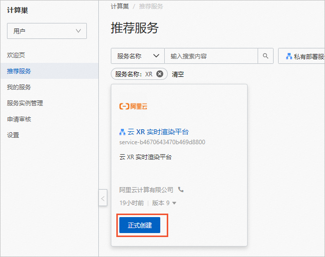
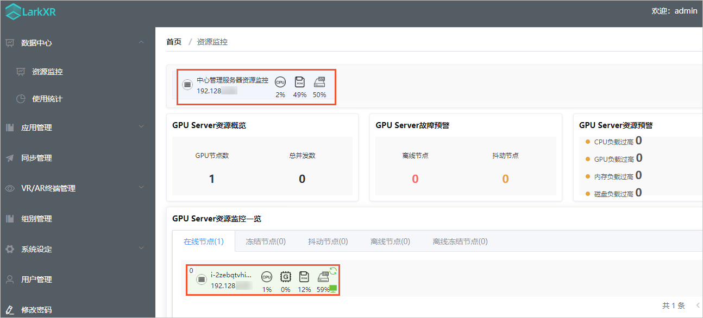
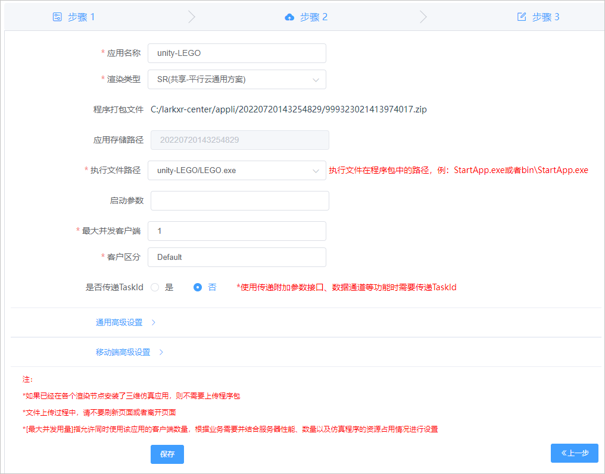
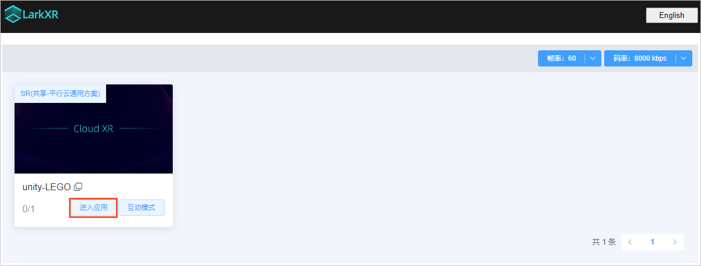
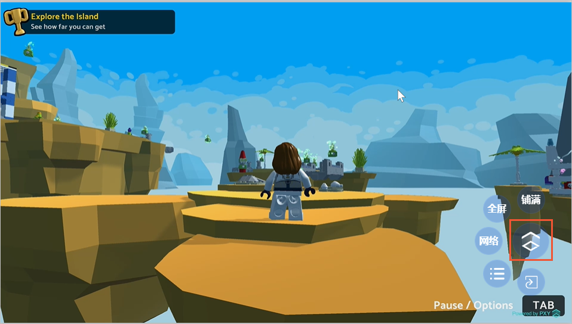

云XR实时渲染平台服务实例部署文档 
======================================

>**免责声明：**本文档可能包含第三方产品信息，该信息仅供参考。阿里云对第三方产品的性能、可靠性以及操作可能带来的潜在影响，不做任何暗示或其他形式的承诺。
>
阿里云云XR平台提供3D应用和元宇宙应用的实时渲染计算、音视频流推送服务和应用发布与用户管理服务，可以帮助您将已运行在本地GPU工作站或本地服务器上的3D应用或元宇宙应用在云上发布，您可以使用多种流行终端随时随地的接入应用。本文向您介绍如何部署云XR实时渲染平台服务实例。

前提条件
----

部署云XR实时渲染平台服务实例前，您的阿里云账号需满足以下条件：

* 由于该服务需要购买云市场镜像，因此您的账号需要有购买云市场镜像商品的权限。

* 创建云XR实时渲染平台服务实例，需要对部分阿里云资源进行访问和创建操作。因此您的账号需要包含如下资源的权限。
  **说明** 当您的账号是RAM账号时，才需要添加此权限。
  

  |             权限策略名称              |             备注             |
  |---------------------------------|----------------------------|
  | AliyunECSFullAccess             | 管理云服务器服务（ECS）的权限           |
  | AliyunVPCFullAccess             | 管理专有网络（VPC）的权限             |
  | AliyunROSFullAccess             | 管理资源编排服务（ROS）的权限           |
  | AliyunESSFullAccesss            | 管理弹性伸缩服务（ESS）的权限           |
  | AliyunComputeNestUserFullAccess | 管理计算巢服务（ComputeNest）的用户侧权限 |
  | AliyunOSSFullAccess             | 管理对象存储服务（OSS）权限            |
  | AliyunCloudMonitorFullAccess    | 管理云监控（CloudMonitor）的权限     |

  

费用说明 
-------------------------

云XR实时渲染平台服务的费用如下：

* ECS实例、云盘和网络流量的费用为标准费用。

* 云市场收费镜像费用：渲染节点数量 x 镜像基础费用。镜像基础费用如下表所示。

  

  |       适用实例规格族        | GRID驱动版本 |  按量付费   |   包月   |   包年    |
  |----------------------|----------|---------|--------|---------|
  | vgn6i-vws, vgn7i-vws | 463.15   | 0.67元/时 | 320元/月 | 3200元/年 |
  | gn6i, gn7i           | 513.46   | 1.13元/时 | 540元/月 | 5840元/年 |

  

  

开放端口说明 
---------------------------

云XR部署在阿里云，管理节点和渲染节点都有外网IP，并且集群部署在同一个私网内。通过外网访问云XR时，管理节点和渲染节点需要开放的端口说明如下表所示。

**管理节点**

|  端口  | 协议  | 是否必须开放 |    用途     |                                         备注                                         |
|------|-----|--------|-----------|------------------------------------------------------------------------------------|
| 8181 | TCP | 是      | 前台页面及接口服务 | 无                                                                                  |
| 8182 | TCP | 否      | 管理后台页面    | 根据您的需要选择是否开放该端口。 如果考虑安全性可以不开放，但管理云XR后台需要通过远程登录到管理节点后，在本地访问管理后台的页面。 |

**渲染节点**

|     端口      | 协议  | 是否必须开放 |     用途      |                    备注                    |
|-------------|-----|--------|-------------|------------------------------------------|
| 10002       | TCP | 是      | WebSocket端口 | 无                                        |
| 10011-10030 | UDP | 是      | 流媒体端口       | 一路并发占用一个端口，可以根据自己应用在单个渲染节点的最大并发数来按需开放端口。 |

使用说明 
-------------------------

1. 登录[计算巢控制台](https://computenest.console.aliyun.com/user/cn-hangzhou/recommendService)，在 **推荐服务** 页，找到 **云XR实时渲染平台** 服务。

   

2. 单击 **正式创建** 或者直接从服务商处获取部署链接。进入服务实例部署页面。

   

3. 在创建服务实例页面，需先选中 **同意授权并创建关联角色** ，选中后即可继续创建服务实例。

   

4. 在创建服务实例页面，根据界面提示填写参数完成部署。

   根据场景需求，选择对应的实例规格和GRID驱动版本。详细的实例规格和对应的驱动版本如下表所示。

   |       适用实例规格族       | GRID驱动版本 |
   |---------------------|----------|
   | vgn6i-vws，vgn7i-vws | 463.15   |
   | gn6i，gn7i           | 513.46   |

   

参数说明 
-------------------------

您在创建服务实例的过程中，需要配置服务实例信息。下文介绍云XR实时渲染平台服务实例输入参数的详细信息。

| 参数组  |   参数项   |           示例            |                                                                                                                                                                                                                                 说明                                                                                                                                                                                                                                 |
|------|---------|-------------------------|--------------------------------------------------------------------------------------------------------------------------------------------------------------------------------------------------------------------------------------------------------------------------------------------------------------------------------------------------------------------------------------------------------------------------------------------------------------------|
| 地域            || 华北2（北京）                 | 选中服务实例的地域，建议就近选则，以获取更好的网络体验。 当前地域仅支持：华北2（北京）、华北3（张家口）、华东1（杭州）、华东2（上海）、华南1（深圳）、华南2（河源）、华南3（广州）、西南1（成都）和中国香港。                                                                                                                                                                                                                                                                                                                                                        |
| 渲染节点 | 节点数量    | 1                       | 设置创建的GPU ECS数量。 一个节点支持一路应用，创建后节点数量不可更改。                                                                                                                                                                                                                                                                                                                                                                                                                            |
| 渲染节点 | 实例规格    | ecs.vgn6i-m4-vws.xlarge | 选择渲染节点的实例规格。 当前服务只支持以下两种共4个vGPU规格： * [vgn6i-vws](t9548.md#concept-sx4-lxv-tdb/vgn6i)/[vgn7i-vws](t9548.md#concept-sx4-lxv-tdb/vgn7i-vws)  * [gn6i](https://help.aliyun.com/document_detail/25378.html#gn6i)/[gn7i](https://help.aliyun.com/document_detail/25378.html#gn7i)   |
| 渲染节点 | 系统盘类型   | cloud_essd              | 选择渲染节点的系统盘类型。可选值： * cloud_efficiency：高效云盘  * cloud_ssd：SSD云盘  * cloud_essd：ESSD云盘                                                                                                                                                                                                                                                           |
| 渲染节点 | 系统盘大小   | 40                      | 设置渲染节点的系统盘大小。默认值：40，取值范围：40\~500，单位GiB。                                                                                                                                                                                                                                                                                                                                                                                                                            |
| 渲染节点 | 是否创建数据盘 | 否                       | 默认不需要使用数据盘。                                                                                                                                                                                                                                                                                                                                                                                                                                                        |
| 管理节点 | 实例规格    | ecs.s6-c1m2.xlarge      | 选择管理节点的实例规格。                                                                                                                                                                                                                                                                                                                                                                                                                                                       |
| 管理节点 | 系统盘类型   | cloud_essd              | 选择管理节点的系统盘类型。可选值： * cloud_efficiency：高效云盘  * cloud_ssd：SSD云盘  * cloud_essd：ESSD云盘                                                                                                                                                                                                                                                           |
| 管理节点 | 系统盘大小   | 40                      | 设置管理节点的系统盘大小。默认值：40，取值范围：40\~500，单位GiB。                                                                                                                                                                                                                                                                                                                                                                                                                            |
| 管理节点 | 是否创建数据盘 | 否                       | 默认不需要使用数据盘。                                                                                                                                                                                                                                                                                                                                                                                                                                                        |
| 基础配置 | VPC ID  | vpc-xxx                 | 选择专有网络的ID。                                                                                                                                                                                                                                                                                                                                                                                                                                                         |
| 基础配置 | 交换机可用区  | 可用区 H                   | 选择交换机的可用区。若可用区为空, 可能是选定的实例规格无库存，请尝试切换 **渲染节点** 的实例规格。                                                                                                                                                                                                                                                                                                                                                                                                              |
| 基础配置 | 交换机ID   | vsw-xxx                 | 选择交换机ID。若找不到交换机, 可尝试切换地域和可用区                                                                                                                                                                                                                                                                                                                                                                                                                                       |
| 基础配置 | 实例密码    | \*\*\*\*\*\*\*\*        | 设置实例密码。长度8\~30个字符，必须包含三项（大写字母、小写字母、数字、 ()\`\~!@#$%\^\&\*_-+=\|{}\[\]:;'\<\>,.?/ 中的特殊符号）。                                                                                                                                                                                                                                                                                                                                                                           |
| 基础配置 | 付费模式    | PostPaid                | 选择付费模式。可选值： * PostPaid：按量付费  * PrePaid：预付费，包年包月                                                                                                                                                                                                                                                                                                                               |
| 基础配置 | 流量付费类型  | PayByTraffic            | 选择流量付费类型。可选值： * PayByTraffic：按流量付费  * PayByBandwidth：按带宽付费                                                                                                                                                                                                                                                                                                                    |
| 基础配置 | 公网带宽    | 100                     | 设置公网带宽。取值范围：0\~100，单位：Mbps。 当公网带宽设置为0时，表示没有公网IP。若无公网IP时，需要确保实例能以其他方式访问外网，以便能够顺利激活本产品。                                                                                                                                                                                                                                                                                                                                                                              |

查看服务实例 
---------------------------

服务实例创建成功后，部署时间大约需要10分组。部署完成后，您需要获取管理节点IP用于后续操作。

1. 打开[服务实例管理](https://computenest.console.aliyun.com/user/cn-hangzhou/serviceInstance/private)页面中，单击服务实例ID，进入服务实例详情页面。

2. 单击 **资源** 页签，找到管理节点（管理节点的资源名称为xr-admin），记录管理节点的公网IP地址（例如123.56.x.x）。

登录云XR管理页并添加应用 
----------------------------------

1. 登录管理页。

   1. 使用管理节点IP加8182端口，登录管理页面。本文以上文获取的管理节点的IP地址http://123.56.x.x:8182为例。

      
   
   2. 在登录页面输入登录ID、密码和验证码后，单击 **登录** 。

      首次登录云XR，使用默认登录ID和密码。

      * 登录ID：admin
      
      * 密码：123456
      

      

      **重要** 为保证您的账号安全，首次登录云XR后，请先修改密码。

      登录云XR管理页后，在左侧导航栏中单击 **修改密码** ，即可进入修改密码页面进行修改。
      
   
   3. 您可以在资源监控页面，查看当前服务的资源信息。

      
   

   

2. 添加应用。

   1. 在云XR管理页的左侧导航栏中，选择 **应用管理** \> **应用一览** 。

      
   
   2. 在 **应用一览** 页面中，单击 **添加应用** 。

      
   
   3. 在 **添加应用** 页面，选择 **上传绿色面安装版程序** 并单击 **下一步** 。

      
   
   4. 单击虚线框中的 **点击上传** ，在弹出的弹框中选择您要上传的3D应用的zip包，或者将zip包直接拖入虚线框中。

      若您想测试添加功能，可使用我们为您提供的测试应用。单击[Unity-LEGO.zip](https://xr-paas.oss-cn-beijing.aliyuncs.com/unity-LEGO.zip)，可下载测试应用包。
   
   5. 上传完成后，单击 **下一步** ，在弹出的界面中，根据你上传的应用包填写数据。

      
   
   6. 单击 **保存** 。

      保存后可在 **应用一览** 界面查看应用信息。
      
   

   

访问云XR应用 
----------------------------

应用上传成功后，您可以登录应用展示页查看应用。

1. 使用管理节点IP加8181端口，登录应用展示页，单击 **进入应用** 。

2. 进入应用后，您可以进行如下操作。
   * 在应用内部时，您可以通过应用支持的输入方式来操控。如测试应用unity-LEGO为例，您可以使用键盘的W、A、S、D控制移动；单击或双击空格，控制小跳或大跳；单击TAG键设置菜单。

     
   
   * 单击右下角的控制球，会展开铺满、全屏、网络等二级菜单。
   
   * 单击Esc键可切出应用。
   
   * 单击二级菜单中的退出或直接关闭浏览器的标签页即可退出程序。
   

   

XR集群运维 
---------------------------

当服务实例的集群渲染节点个数不满足需要时, 可通过计算巢的扩容功能来增加渲染节点。

1. 登录[计算巢控制台](https://computenest.console.aliyun.com/user/cn-hangzhou/recommendService)。

   

2. 在左侧导航栏中，单击 **服务实例管理** ，进入服务实例管理页面。

   

3. 单击服务实例ID，进入服务实例详情页。然后单击 **运维管理** 页签。

   

4. 在 **应用运维** 区域，单击 **弹性扩缩容** 。

   

5. 在弹出的 **弹性扩缩容** 弹框中，配置对应的扩容参数并单击 **下一步** 。

   

6. 确认参数信息后，单击 **确定** 。完成扩容。

创建混合实例规格或可用区节点 
-----------------------------------

基于已有的渲染节点实例，通过克隆伸缩组，调整伸缩组配置等操作实现混合实例规格或可用区节点的创建。

1. **克隆伸缩组**
   1. 在 **服务实例详情** 页中，单击 **资源** 页签。
   
   2. 在资源页签中，单击名称前缀为asg的伸缩组ID，进入伸缩组基本信息界面。
   
   3. 单击右上角的 **克隆** 。
   
   4. 在弹出的 **克隆伸缩组** 弹框中，修改 **伸缩组名称** 、选中 **选择已有实例** 、选择已有的渲染节点和 **选择交换机** 等配置。
      **说明** 选择已有实例时，推荐选择-0000后缀的实例。
      
   
   5. 单击 **确认创建** 。

      单击后，页面将跳转至[弹性伸缩控制台](https://essnew.console.aliyun.com/)。
       

2. **修改伸缩组配置**
   1. 在转跳后的界面右上角，单击 **启用** ，待伸缩组配置启用后，单击 **实例配置来源** 页签，并在需要修改的伸缩组对应的 **操作** 列，单击 **修改** 。
   
   2. 在 **实例规格** 区域，修改伸缩组的实例规格。

      为避免后续管理混淆，建议只保留一种规格。目前可选择的实例规格，请参见[费用说明](#section-kmr-eq9-4ne)。
      
   
   3. 在 **镜像** 区域，选择 **镜像市场** \> **重新选择镜像** 。
   
   4. 在弹框中搜索xr，在搜索结果中选择最新版本然后单击 **使用** 。
   
   5. 单击右下角的 **下一步系统配置** ，在 **系统配置（选填）** 页签，修改 **实例名称** 与 **主机名** 。
   
   6. 单击右下角的 **下一步系统配置** ，在 **确认配置** 页签中，确认修改信息。然后单击 **确认修改** 。

3. **将伸缩组添加到XR实例**

   提交计算巢工单，申请将创建好的伸缩组，添加至对应的XR实例。工单填写示例如下：
   * 工单类型：计算巢
   
   * 需求：申请将伸缩组添加至XR服务实例
   
   * 伸缩组ID：asg-xxx
   
   * 服务实例ID：si-xxx

4. **使用伸缩组**
   1. 工单处理成功后，打开[服务实例管理](https://computenest.console.aliyun.com/user/cn-hangzhou/serviceInstance/private)页面中，单击服务实例ID，进入服务实例详情页面。
   
   2. 在服务详情页面，单击 **资源** ，查看创建的伸缩组。
   
   3. 单击 **运维管理** ，然后在 **应用运维** 区域单击 **弹性扩缩容** 时，在设置界面中可以根据需要选择上面创建的伸缩组。更多信息，请参见[XR集群运维](#section-87f-3fh-35b)。

5. **删除伸缩组**

   在释放XR实例之前，请到[弹性伸缩控制台](https://essnew.console.aliyun.com/)删除手工创建的伸缩组，避免因依赖问题导致XR实例释放失败。   

